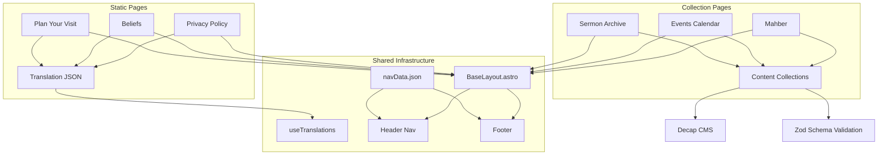

# Design Document: Church Website Essential Pages

## Overview

This design adds six essential pages to the Debre Mihret St. Gebriel EOTC website: Plan Your Visit, Beliefs, Sermon Archive, Events Calendar, Mahber (Fellowships & Services), and Privacy Policy. Each page follows the established bilingual (EN/AM) architecture with prefix-based routing, LESS styling with CodeStitch patterns, Decap CMS content management, and Astro Content Collections with Zod schema validation.

The pages fall into two categories:
1. **Static content pages** (Visit, Beliefs, Privacy) — content managed via translation namespace JSON files
2. **Collection-driven pages** (Sermons, Events, Mahber) — content managed via Decap CMS with Astro Content Collections

All pages share the existing `BaseLayout.astro`, use `useTranslations(locale)` for UI labels, and integrate into the `navData.json`-driven navigation system.

## Architecture



### Routing Strategy

Each page is duplicated per locale following the existing pattern:
- `src/pages/en/{slug}.astro` and `src/pages/am/{slug}.astro` for static pages
- `src/pages/en/{slug}/[...page].astro` and `src/pages/am/{slug}/[...page].astro` for paginated collection pages

Routes:
| Page | EN Route | AM Route |
|------|----------|----------|
| Plan Your Visit | `/en/visit/` | `/am/visit/` |
| Beliefs | `/en/beliefs/` | `/am/beliefs/` |
| Sermon Archive | `/en/sermons/` | `/am/sermons/` |
| Events Calendar | `/en/events/` | `/am/events/` |
| Mahber | `/en/mahber/` | `/am/mahber/` |
| Privacy Policy | `/en/privacy/` | `/am/privacy/` |

Unsupported locale prefixes naturally return 404 via Astro's file-based routing — only `/en/` and `/am/` directories exist.

### Client-Side Interactivity

- **Sermon Archive**: Client-side filtering by series and inline media player (HTML5 `<audio>`/`<video>` elements toggled via vanilla JS)
- **Events Calendar**: Client-side category filtering via vanilla JS (no framework needed)
- **All other pages**: Fully static, no client-side JS required

## Components and Interfaces

### New Page Components

| Component | Path | Purpose |
|-----------|------|---------|
| `visit.astro` | `src/pages/{locale}/visit.astro` | Plan Your Visit static page |
| `beliefs.astro` | `src/pages/{locale}/beliefs.astro` | Beliefs/Statement of Faith static page |
| `[...page].astro` | `src/pages/{locale}/sermons/[...page].astro` | Sermon Archive with pagination |
| `events.astro` | `src/pages/{locale}/events.astro` | Events Calendar page |
| `mahber.astro` | `src/pages/{locale}/mahber.astro` | Mahber/Fellowships page |
| `privacy.astro` | `src/pages/{locale}/privacy.astro` | Privacy Policy static page |

### New Reusable Components

| Component | Path | Purpose |
|-----------|------|---------|
| `SermonCard` | `src/components/SermonCard/SermonCard.astro` | Displays a single sermon entry with inline player toggle |
| `SermonFilter` | `src/components/SermonFilter/SermonFilter.astro` | Series filter dropdown for sermons |
| `EventCard` | `src/components/EventCard/EventCard.astro` | Displays a single event entry |
| `EventFilter` | `src/components/EventFilter/EventFilter.astro` | Category filter buttons for events |
| `MahberCard` | `src/components/MahberCard/MahberCard.astro` | Displays a single mahber/fellowship entry |
| `MediaPlayer` | `src/components/MediaPlayer/MediaPlayer.astro` | Inline audio/video player for sermons |

### Component Interfaces

```typescript
// SermonCard Props
interface SermonCardProps {
  title: string;
  date: Date;
  speaker: string;
  description: string;
  mediaUrl: string;
  mediaType: "audio" | "video";
  series: string;
}

// EventCard Props
interface EventCardProps {
  title: string;
  date: Date;
  endDate?: Date;
  time: string;
  location: string;
  description: string;
  category: "feast-day" | "sunday-school" | "community" | "youth";
}

// MahberCard Props
interface MahberCardProps {
  name: string;
  description: string;
  schedule: string;
  contactName: string;
  contactEmail?: string;
  image?: ImageMetadata;
}

// MediaPlayer Props
interface MediaPlayerProps {
  src: string;
  type: "audio" | "video";
  title: string;
}
```

### Navigation Updates

The `navData.json` will be extended with new top-level entries:

```json
[
  { "key": "visit", "url": "/visit", "label": { "en": "Plan Your Visit", "am": "ጉብኝት ያቅዱ" }, "children": [] },
  { "key": "beliefs", "url": "/beliefs", "label": { "en": "Beliefs", "am": "እምነት" }, "children": [] },
  { "key": "sermons", "url": "/sermons", "label": { "en": "Sermons", "am": "ስብከት" }, "children": [] },
  { "key": "events", "url": "/events", "label": { "en": "Events", "am": "ዝግጅቶች" }, "children": [] },
  { "key": "mahber", "url": "/mahber", "label": { "en": "Fellowships & Services", "am": "ማኅበራት" }, "children": [] }
]
```

The Privacy Policy link is added to the Footer component rather than the main navigation.

### Translation Namespaces

New namespace JSON files to create:

| Namespace | Path | Content |
|-----------|------|---------|
| `visit` | `src/locales/{locale}/visit.json` | All Plan Your Visit page text |
| `beliefs` | `src/locales/{locale}/beliefs.json` | All Beliefs page text |
| `sermons` | `src/locales/{locale}/sermons.json` | Sermon Archive UI labels |
| `events` | `src/locales/{locale}/events.json` | Events Calendar UI labels |
| `mahber` | `src/locales/{locale}/mahber.json` | Mahber page UI labels |
| `privacy` | `src/locales/{locale}/privacy.json` | All Privacy Policy text |

## Data Models

### Sermons Collection

**File**: `src/content/sermons/{locale}/*.md`

```typescript
// Zod schema in content.config.ts
const sermonsCollection = defineCollection({
  loader: glob({ pattern: "**/[^_]*.{md,mdx}", base: "./src/content/sermons" }),
  schema: z.object({
    title: z.string(),
    date: z.date(),
    speaker: z.string(),
    description: z.string(),
    mediaUrl: z.string().url(),
    mediaType: z.enum(["audio", "video"]),
    series: z.string(),
    mappingKey: z.string().regex(
      /^[a-z0-9]+(?:-[a-z0-9]+)*$/,
      "MappingKey must be lowercase alphanumeric with hyphens only"
    ),
  }),
});
```

### Events Collection

**File**: `src/content/events/{locale}/*.md`

```typescript
const eventsCollection = defineCollection({
  loader: glob({ pattern: "**/[^_]*.{md,mdx}", base: "./src/content/events" }),
  schema: z.object({
    title: z.string().max(150),
    date: z.date(),
    endDate: z.date().optional(),
    time: z.string(),
    location: z.string().max(200),
    description: z.string().max(500),
    category: z.enum(["feast-day", "sunday-school", "community", "youth"]),
    recurring: z.boolean(),
    mappingKey: z.string().regex(
      /^[a-z0-9]+(?:-[a-z0-9]+)*$/,
      "MappingKey must be lowercase alphanumeric with hyphens only"
    ),
  }),
});
```

### Mahber Collection

**File**: `src/content/mahber/{locale}/*.md`

```typescript
const mahberCollection = defineCollection({
  loader: glob({ pattern: "**/[^_]*.{md,mdx}", base: "./src/content/mahber" }),
  schema: ({ image }) =>
    z.object({
      name: z.string().max(100),
      description: z.string().max(500),
      schedule: z.string(),
      contactName: z.string(),
      contactEmail: z.string().email().optional(),
      image: image().optional(),
      order: z.number(),
      mappingKey: z.string().regex(
        /^[a-z0-9]+(?:-[a-z0-9]+)*$/,
        "MappingKey must be lowercase alphanumeric with hyphens only"
      ),
    }),
});
```

### Decap CMS Collections

Three new collections added to `public/admin/config.yml`:

```yaml
- name: "sermons"
  label: "Sermons"
  folder: "src/content/sermons"
  create: true
  i18n: true
  fields:
    - { label: "Title", name: "title", widget: "string", i18n: true }
    - { label: "Date", name: "date", widget: "datetime", i18n: duplicate }
    - { label: "Speaker", name: "speaker", widget: "string", i18n: duplicate }
    - { label: "Description", name: "description", widget: "text", i18n: true }
    - { label: "Media URL", name: "mediaUrl", widget: "string", i18n: duplicate }
    - { label: "Media Type", name: "mediaType", widget: "select", options: ["audio", "video"], i18n: duplicate }
    - { label: "Series", name: "series", widget: "string", i18n: true }
    - { label: "Mapping Key", name: "mappingKey", widget: "string", i18n: duplicate }

- name: "events"
  label: "Events"
  folder: "src/content/events"
  create: true
  i18n: true
  fields:
    - { label: "Title", name: "title", widget: "string", i18n: true }
    - { label: "Date", name: "date", widget: "datetime", i18n: duplicate }
    - { label: "End Date", name: "endDate", widget: "datetime", required: false, i18n: duplicate }
    - { label: "Time", name: "time", widget: "string", i18n: duplicate }
    - { label: "Location", name: "location", widget: "string", i18n: true }
    - { label: "Description", name: "description", widget: "text", i18n: true }
    - { label: "Category", name: "category", widget: "select", options: ["feast-day", "sunday-school", "community", "youth"], i18n: duplicate }
    - { label: "Recurring", name: "recurring", widget: "boolean", default: false, i18n: duplicate }
    - { label: "Mapping Key", name: "mappingKey", widget: "string", i18n: duplicate }

- name: "mahber"
  label: "Mahber (Fellowships)"
  folder: "src/content/mahber"
  create: true
  i18n: true
  fields:
    - { label: "Name", name: "name", widget: "string", i18n: true }
    - { label: "Description", name: "description", widget: "text", i18n: true }
    - { label: "Schedule", name: "schedule", widget: "string", i18n: true }
    - { label: "Contact Name", name: "contactName", widget: "string", i18n: duplicate }
    - { label: "Contact Email", name: "contactEmail", widget: "string", required: false, i18n: duplicate }
    - { label: "Image", name: "image", widget: "image", required: false, i18n: duplicate }
    - { label: "Display Order", name: "order", widget: "number", i18n: duplicate }
    - { label: "Mapping Key", name: "mappingKey", widget: "string", i18n: duplicate }
```


## Correctness Properties

*A property is a characteristic or behavior that should hold true across all valid executions of a system — essentially, a formal statement about what the system should do. Properties serve as the bridge between human-readable specifications and machine-verifiable correctness guarantees.*

### Property 1: Translation fallback returns key path for missing keys

*For any* locale and any key path string that does not exist in the loaded namespace, the translation function `t(key)` SHALL return the key path itself as fallback text.

**Validates: Requirements 1.3**

### Property 2: Sermons are sorted descending by date with pagination bounds

*For any* set of sermon entries and any page number, the sermons displayed on that page SHALL be in strictly descending date order, and the number of entries on any single page SHALL NOT exceed 12.

**Validates: Requirements 3.2**

### Property 3: Content collection schema validation

*For any* content entry object (sermon, event, or mahber), if all required fields are present with correct types and constraints, the Zod schema SHALL accept it; if any required field is missing or has an invalid type/value, the schema SHALL reject it.

**Validates: Requirements 3.3, 4.3, 5.3**

### Property 4: Sermon series filter returns only matching entries

*For any* set of sermon entries and any selected series value, filtering by that series SHALL return only entries whose series field equals the selected value, and filtering by "All" SHALL return all entries unchanged.

**Validates: Requirements 3.6**

### Property 5: Event date partitioning and sort order

*For any* set of event entries and any reference date, events SHALL be partitioned into "upcoming" (date >= reference date, sorted ascending) and "past" (date < reference date, sorted descending), with no event appearing in both partitions and all events accounted for.

**Validates: Requirements 4.2, 4.8**

### Property 6: Event category filter returns only matching entries

*For any* set of event entries and any selected category value from the allowed set (feast-day, sunday-school, community, youth), filtering by that category SHALL return only entries whose category field equals the selected value.

**Validates: Requirements 4.5**

### Property 7: Mahber rendering includes all required fields

*For any* valid mahber entry, the rendered card output SHALL contain the entry's name, description, schedule, and contactName values.

**Validates: Requirements 5.2**

### Property 8: Mahber entries are sorted by order field ascending

*For any* set of mahber entries with distinct order values, the displayed list SHALL be sorted in strictly ascending order by the order field.

**Validates: Requirements 5.5**

## Error Handling

### Empty Collection States

| Collection | Condition | Behavior |
|------------|-----------|----------|
| Sermons | No entries exist | Display placeholder message from `sermons` namespace (`emptyState` key) |
| Sermons | Filter yields no results | Display "no sermons found for this series" message |
| Events | No upcoming events | Display placeholder message from `events` namespace (`noUpcoming` key) |
| Mahber | No entries exist | Display placeholder message from `mahber` namespace (`emptyState` key) |

### Translation Fallbacks

- Missing translation key: Returns the key path string (e.g., `"visit:parking.title"`)
- Missing namespace file: `loadNamespace()` logs a console warning and returns empty object `{}`
- Nested key traversal failure: Returns the full key path as fallback

### Invalid Content Data

- Zod schema validation failures are caught at build time by Astro Content Collections
- Invalid `mediaUrl` in sermons: The media player component renders a fallback "media unavailable" message
- Invalid `date` fields: Build fails with Zod validation error (caught during `astro build`)

### Routing Errors

- Unsupported locale prefix: Astro returns 404 automatically (no matching file route)
- Missing page files: Astro's built-in 404 page handles this

### Media Player Errors

- Failed media load: The `<audio>`/`<video>` element's `onerror` event displays a user-friendly error message
- Unsupported format: Browser's native media error handling applies

## Testing Strategy

### Property-Based Tests

**Library**: [fast-check](https://github.com/dubzzz/fast-check) (JavaScript/TypeScript PBT library)

Each correctness property is implemented as a single property-based test with a minimum of 100 iterations. Tests target the pure logic functions extracted from page components.

**Testable functions to extract:**

```typescript
// src/js/sermonUtils.ts
export function sortSermonsByDate(sermons: Sermon[]): Sermon[];
export function filterSermonsBySeries(sermons: Sermon[], series: string | "all"): Sermon[];
export function paginateEntries<T>(entries: T[], page: number, pageSize: number): T[];

// src/js/eventUtils.ts
export function partitionEventsByDate(events: Event[], referenceDate: Date): { upcoming: Event[]; past: Event[] };
export function filterEventsByCategory(events: Event[], category: string): Event[];

// src/js/mahberUtils.ts
export function sortMahberByOrder(entries: Mahber[]): Mahber[];

// src/js/translationUtils.ts (existing, test the fallback behavior)
export function useTranslations(locale: Locale): (key: string) => string;
```

**Test configuration:**
- Runner: Vitest (compatible with Astro projects)
- PBT library: fast-check
- Minimum iterations: 100 per property
- Tag format: `Feature: church-website-essential-pages, Property {N}: {title}`

### Unit Tests (Example-Based)

| Test | Validates |
|------|-----------|
| Visit page renders 4 content sections | Req 1.2 |
| Beliefs page has ≥5 heading sections | Req 2.2 |
| Beliefs page uses sequential heading hierarchy | Req 2.6 |
| Sermon card displays title, date, speaker, media type | Req 3.2 |
| Media player renders correct element for audio vs video | Req 3.5 |
| Empty sermon collection shows placeholder | Req 3.8 |
| Empty filter result shows "no sermons" message | Req 3.9 |
| Empty upcoming events shows placeholder | Req 4.9 |
| Empty mahber collection shows placeholder | Req 5.8 |
| Privacy page contains all required sections | Req 6.2 |
| Privacy page references NZ Privacy Act 2020 | Req 6.5 |
| Privacy page shows last-updated date | Req 6.6 |
| Footer contains privacy link with correct locale | Req 6.4 |

### Integration Tests

| Test | Validates |
|------|-----------|
| navData.json contains all new page entries | Req 1.4, 2.4, 3.10, 4.7, 5.7 |
| Decap CMS config.yml defines sermons, events, mahber collections | Req 3.4, 4.4, 5.4 |
| Translation namespace files exist for all locales | Req 1.3, 2.3, 3.7, 4.6, 5.6, 6.3 |
| Astro build succeeds with all new pages | All routing requirements |

### Smoke Tests

| Test | Validates |
|------|-----------|
| `/en/visit/` returns 200 | Req 1.1 |
| `/am/visit/` returns 200 | Req 1.1 |
| `/en/beliefs/` returns 200 | Req 2.1 |
| `/en/sermons/` returns 200 | Req 3.1 |
| `/en/events/` returns 200 | Req 4.1 |
| `/en/mahber/` returns 200 | Req 5.1 |
| `/en/privacy/` returns 200 | Req 6.1 |
| `/fr/visit/` returns 404 | Req 1.5 |
